# 🛤️ 智驭苍穹 · 守路安澜 — Railway AI Warning System

<div align="center">

**空天地多模态短临致灾风险数字孪生预警系统**  
*Air-Space-Ground Multi-Modal Short-Imminent Disaster Risk Digital Twin Warning System*

[](https://www.python.org/)
[](https://pytorch.org/)
[](https://nodejs.org/)
[](https://developers.weixin.qq.com/)
[](https://vercel.com/)
[](LICENSE)
[](https://www.lzu.edu.cn/)

</div>

---

## 📖 项目概述

**「智驭苍穹 · 守路安澜」** 是兰州大学大学生创新训练计划 & 䇹政基金资助的综合性科研项目。系统融合 **深度学习、数值天气预报、卫星遥感、铁路工程、无人机低空感知** 五大技术领域，通过自主研发的 **LoongClaw 动态路由混合专家 (MoE) 框架**，实现铁路沿线短临致灾风险的分钟级智能预警。

> **使命**: 空天地一体 · AI赋能铁路 · 守护万里安澜

<div align="center">
  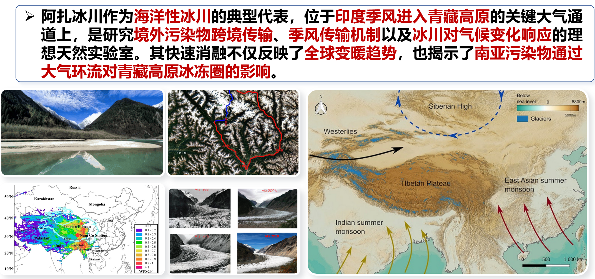
  <p><em>多源遥感数据融合与AI驱动极端天气预报 — 从卫星星座到铁路廊道风险评估</em></p>
</div>

---

## 🏗️ 系统架构

```
┌──────────────────────────────────────────────────────────────────┐
│                    智驭苍穹 · 守路安澜                             │
│                                                                  │
│  ┌─────────────────────┐  ┌──────────────────────────────────┐  │
│  │   📱 交互层           │  │   🌐 展示层                       │  │
│  │   微信小程序 (12页面)  │  │   Web 3D 可视化大屏 (7页面)       │  │
│  │   Apple Design       │  │   Three.js · GSAP · ECharts     │  │
│  └─────────┬────────────┘  └──────────────┬───────────────────┘  │
│            │                              │                       │
│  ┌─────────┴──────────────────────────────┴───────────────────┐  │
│  │                    🔌 API 服务层 (Express)                   │  │
│  │          /api/chat (千问AI) · /api/weather (高德天气)       │  │
│  └─────────────────────────────┬───────────────────────────────┘  │
│                                │                                  │
│  ┌─────────────────────────────┴───────────────────────────────┐  │
│  │                  🧠 认知层 — LoongClaw MoE                    │  │
│  │   ┌────────┬────────┬────────┬────────┐                      │  │
│  │   │ AI专家  │物理专家 │气象专家 │铁路专家 │  四大专家协同推理    │  │
│  │   │MambaSwin│COTREC  │FY-4A   │灾害KG  │  动态路由自适应权重  │  │
│  │   └────────┴────────┴────────┴────────┘                      │  │
│  └─────────────────────────────┬───────────────────────────────┘  │
│                                │                                  │
│  ┌─────────────────────────────┴───────────────────────────────┐  │
│  │                    📡 感知层                                  │  │
│  │   雷达网 · 卫星星座 · 无人机蜂群 · 地面IoT · 探空站           │  │
│  └─────────────────────────────────────────────────────────────┘  │
└──────────────────────────────────────────────────────────────────┘
```

<div align="center">
  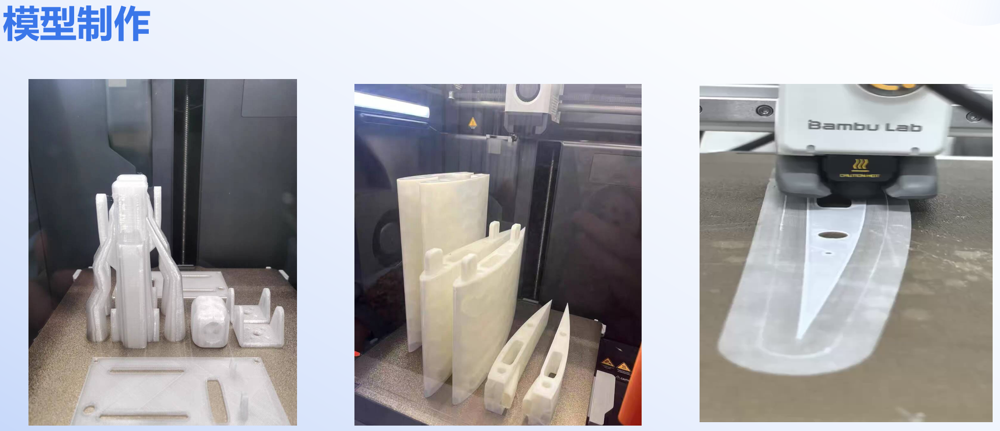
  <p><em>LoongClaw 科研框架 — 桥接大气科学、人工智能与铁路工程</em></p>
</div>

---

## 📁 仓库结构

```
railway-ai-warning/
│
├── 📄 README.md                              # 主文档 (本文件)
├── 📄 LICENSE                                # MIT 许可证
├── 📄 .gitignore                             # Git 忽略规则
│
├── 📁 assets/                                # 🎨 可视化素材
│   ├── figures/                              #   静态图表 (PNG)
│   │   ├── remote_sensing_weather_ai.png     #     遥感+极端天气AI
│   │   ├── research_framework.png            #     LoongClaw框架总览
│   │   ├── project_pipeline.png              #     项目流水线
│   │   ├── ai_natural_systems.png            #     AI+自然系统
│   │   └── physics_ai.png                    #     物理-AI融合
│   └── animations/                           #   动态演示 (GIF)
│       ├── data_fusion.gif                   #     多源数据融合
│       ├── uav_demo_1~3.gif                  #     UAV 视觉识别
│       └── physics_sim_1~3.gif               #     物理约束模拟
│
├── 📁 backend/                               # 🐍 Python ML 框架
│   ├── README.md                             #   后端文档
│   ├── requirements.txt                      #   Python 依赖
│   ├── __init__.py                           #   Dragon 类 (CLI入口)
│   ├── core/                                 #   Agent 引擎
│   │   ├── agent.py                          #     5阶段任务规划
│   │   ├── dialog.py                         #     对话管理器
│   │   ├── memory.py                         #     记忆系统 (短期/长期)
│   │   ├── skills.py                         #     技能管理器 (13技能)
│   │   └── workflow.py                       #     工作流引擎
│   ├── src/                                  #   ML 源代码
│   │   ├── models/                           #     神经网络架构
│   │   │   ├── mamba_swin_unet.py            #       MambaSwin-UNet-STA
│   │   │   ├── router.py                     #       LoongClaw 动态路由
│   │   │   └── physics.py                    #       物理约束 + SCS-CN
│   │   ├── data/                             #     数据处理流水线
│   │   │   ├── preprocess.py                 #       质量控制 & 标准化
│   │   │   ├── features.py                   #       地形/雷达/时序特征
│   │   │   └── interpolate.py                #       缺失值智能插补
│   │   ├── training/train.py                 #     PyTorch Lightning 训练
│   │   └── utils/                            #     工具函数
│   │       ├── losses.py                     #       加权MSE/Focal/SSIM
│   │       ├── metrics.py                    #       TS/POD/FAR/CSI/ETS
│   │       └── common.py                     #       通用工具
│   ├── scripts/                              #   数据下载脚本
│   │   ├── download_era5.py                  #     ERA5 再分析数据
│   │   └── download_dem.py                   #     SRTM DEM 处理
│   ├── configs/                              #   配置文件
│   │   ├── project.yaml                      #     项目阶段 & 设置
│   │   └── model.yaml                        #     模型/训练超参数
│   ├── tests/                                #   单元 & 集成测试
│   ├── skills/                               #   可扩展技能模块
│   ├── knowledge/                            #   领域知识库
│   ├── workflows/                            #   预定义工作流
│   └── notebooks/                            #   Jupyter Notebooks
│
├── 📁 web/                                   # 🌐 Web 可视化大屏
│   ├── index.html                            #   星际入口 (3D粒子)
│   ├── core.html                             #   LoongClaw 引擎架构
│   ├── system.html                           #   全息系统总览
│   ├── community.html                        #   生态合作网络
│   ├── universe.html                         #   技术宇宙全景
│   ├── dashboard.html                        #   实时数据驾驶舱
│   ├── sky.html                              #   无人机蜂群管理
│   ├── scripts/                              #   资讯采集脚本
│   │   └── collect_news_final.py             #     行业资讯自动采集
│   └── assets/                               #   页面素材
│       ├── pdf/                              #     技术白皮书
│       ├── images/                           #     系统截图
│       └── videos/                           #     演示视频
│
├── 📁 miniprogram/                           # 📱 微信小程序
│   ├── project.config.json                   #   项目配置
│   ├── app.js / app.json / app.wxss          #   入口 & 全局样式
│   ├── pages/                                #   12 个业务页面
│   │   ├── launch/                           #     启动页 (全屏动画)
│   │   ├── home/                             #     首页 (核心入口)
│   │   ├── overview/                         #     项目概况
│   │   ├── painpoints/                       #     行业痛点 (三大盲区)
│   │   ├── tech/                             #     四层技术栈可视化
│   │   ├── openclaw/                         #     LoongClaw 引擎详解
│   │   ├── uav/                              #     空天感知无人机平台
│   │   ├── achievement/                      #     成果验证 & 数据展示
│   │   ├── business/                         #     商业模式 (三级火箭)
│   │   ├── team/                             #     跨学科团队
│   │   ├── vision/                           #     社会价值 & 愿景
│   │   └── contact/                          #     预约演示 & 联系
│   ├── components/                           #   8 个可复用组件
│   │   ├── glass-card/                       #     磨砂玻璃卡片
│   │   ├── chart/                            #     Canvas/F2 图表
│   │   ├── data-card/                        #     数据展示卡片
│   │   ├── timeline/                         #     时间轴组件
│   │   ├── progress-ring/                    #     进度环组件
│   │   ├── progress-bar/                     #     进度条
│   │   ├── notice-bar/                       #     通知栏
│   │   └── tech-badge/                       #     技术标签
│   └── images/                               #   图标 & 插图 (84张)
│
├── 📁 api/                                   # 🔌 API 服务
│   ├── README.md                             #   API 文档
│   ├── app.js                                #   Express 服务 (AI + 天气)
│   ├── package.json                          #   Node.js 依赖
│   ├── vercel.json                           #   Vercel 部署配置
│   └── .env.example                          #   环境变量模板
│
├── 📁 research/                              # 🔬 辅助研究代码
│   └── convlstm/                             #   ConvLSTM 基线模型
│       ├── encoder.py / decoder.py           #     Seq2seq 架构
│       ├── model.py                          #     ConvLSTM Cell
│       ├── main.py / predict.py              #     训练 & 推理
│       ├── ConvRNN.py                        #     ConvRNN 变体
│       └── requirements.txt
│
├── 📁 docs/                                  # 📄 项目文档
│   ├── proposals/                            #   申报材料
│   │   └── 萃英基金申报书.pdf                #     䇹政基金申请书
│   ├── technical/                            #   技术文档
│   │   └── technical_proposal.md             #     技术方案
│   ├── data_dict.md                          #   数据字典
│   ├── architecture.md                       #   系统架构
│   ├── plan.md                               #   项目计划
│   ├── roadmap.md                            #   技术路线图
│   └── autodl_guide.md                       #   AutoDL 云GPU指南
│
└── 📁 data/                                  # 📊 数据存储 (gitignored)
```

---

## 🔬 核心创新

### 1. MambaSwin-UNet-STA 深度学习架构

融合 **Mamba 状态空间模型** (线性复杂度序列建模)、**Swin Transformer** (层级窗口注意力)、**U-Net** (多尺度特征编解码) 和 **时空注意力机制 (STA)** 的端到端降水预报模型。

| 特性 | 指标 |
|------|------|
| 参数量 | 45M |
| 推理速度 | 200ms/frame |
| 输入维度 | (B, 6, C, 224, 224) |
| 输出维度 | (B, 6, 224, 224) |
| 核心优势 | 线性复杂度 O(n) vs Transformer 的 O(n²) |

<div align="center">
  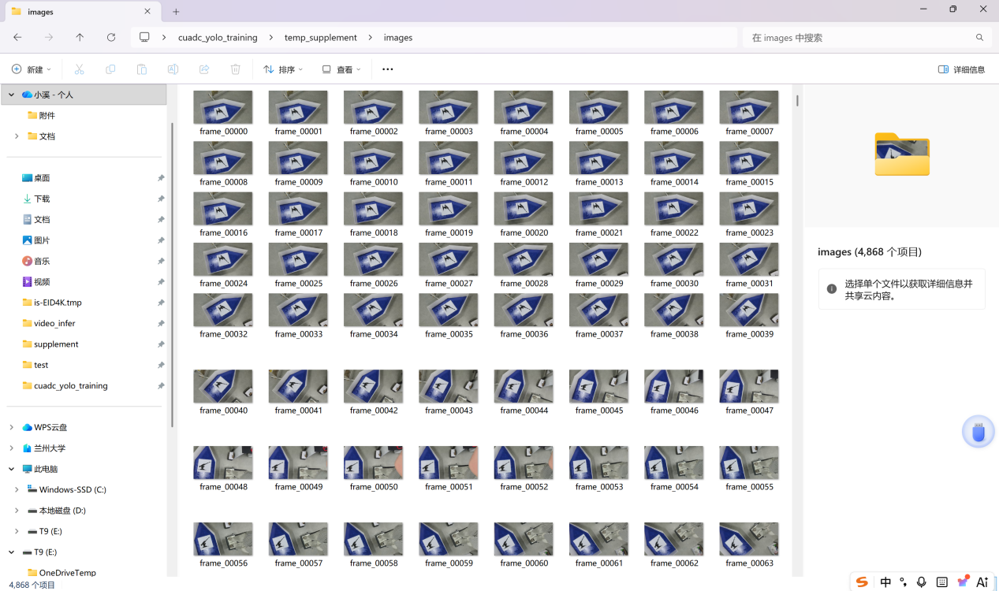
  <p><em>端到端研究流程: 数据采集 → 质量控制 → 特征工程 → 模型训练 → 风险推理 → 可视化</em></p>
</div>

### 2. LoongClaw 动态路由混合专家系统 (MoE)

根据实时天气形势 (对流强度、稳定度指数、系统移速、降水强度、地形复杂度) 自适应分配四大专家权重，实现协同推理。

| 专家 | 核心模型 | 技术特点 |
|------|----------|----------|
| 🤖 **AI专家** | MambaSwin-UNet-STA | 深度学习端到端预报，时空特征自动提取 |
| 🔬 **物理专家** | COTREC + WRF | 数值模式计算，质量/能量守恒物理约束 |
| 🌤️ **气象专家** | FY-4A + 多普勒雷达 | 多源卫星/雷达数据融合，全域覆盖 |
| 🚄 **铁路专家** | 致灾知识图谱 + 脆弱性曲线 | 行业知识驱动，承灾体精准评估 |

### 3. SCS-CN 水文模型耦合

基于 USDA Curve Number 方法，结合 DEM 流向分析 (D8算法)，实现降水→径流→致灾风险的物理约束推演。

```
降水预报 → SCS-CN 径流计算 → D8 汇流分析 → 风险等级 (0-4)
                ↓
         铁路沿线风险提取
                ↓
    边坡失稳 / 路基冲刷 / 积水风险
```

### 4. 多平台全栈交付

| 平台 | 技术栈 | 目标用户 |
|------|--------|----------|
| **Python Backend** | PyTorch Lightning + Dragon Agent | 科研人员、算法工程师 |
| **Web Dashboard** | HTML5 + Three.js + GSAP + TailwindCSS | 管理者、决策者 |
| **WeChat Mini Program** | 原生开发 + Apple Design | 公众用户、一线人员 |
| **API Service** | Express.js + Vercel Serverless | 第三方开发者 |

<div align="center">
  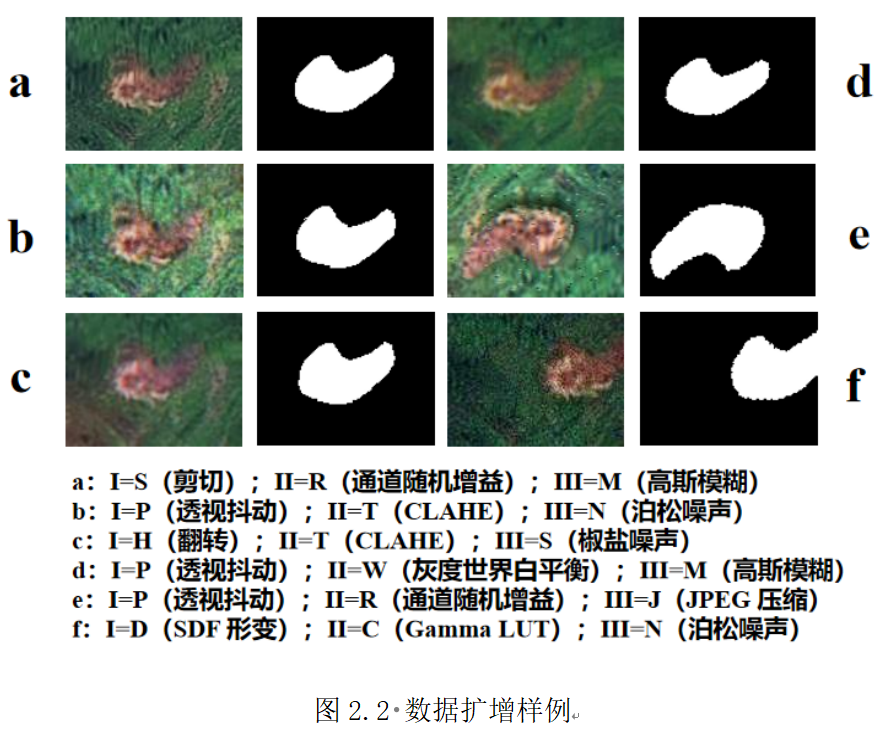
  <p><em>AI 驱动的复杂大气系统理解 — 从数据到洞察</em></p>
</div>

---

## 🎬 动态演示

### 多源数据融合

<div align="center">
  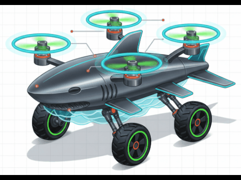
  
  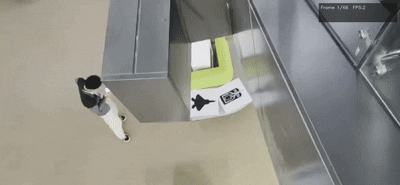
  <p><em>多源数据融合动态过程 · UAV 视觉识别演示 1 · UAV 视觉识别演示 2</em></p>
</div>

### 物理约束模拟

<div align="center">
  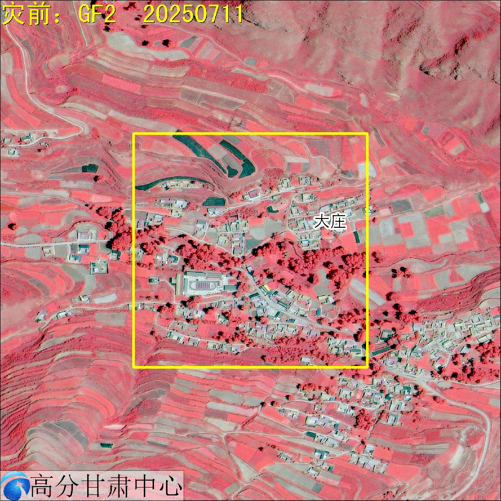
  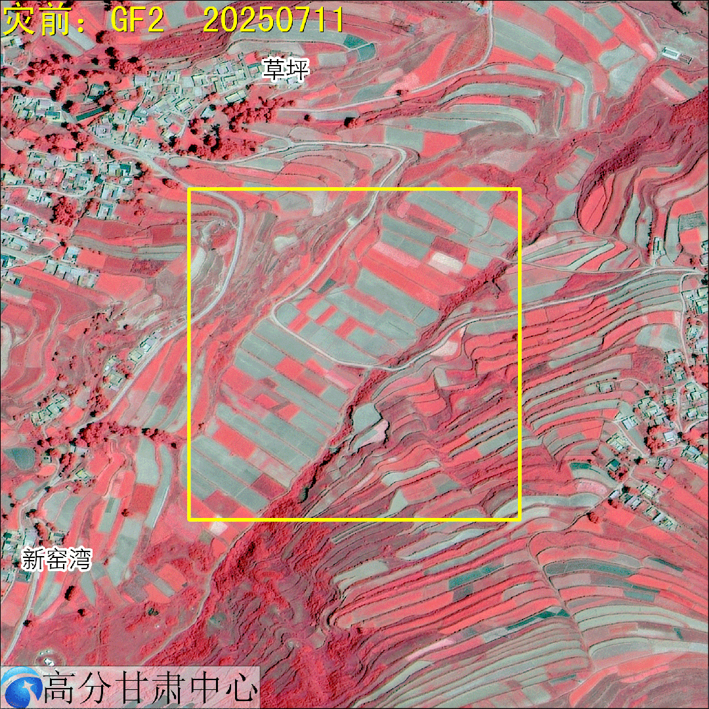
  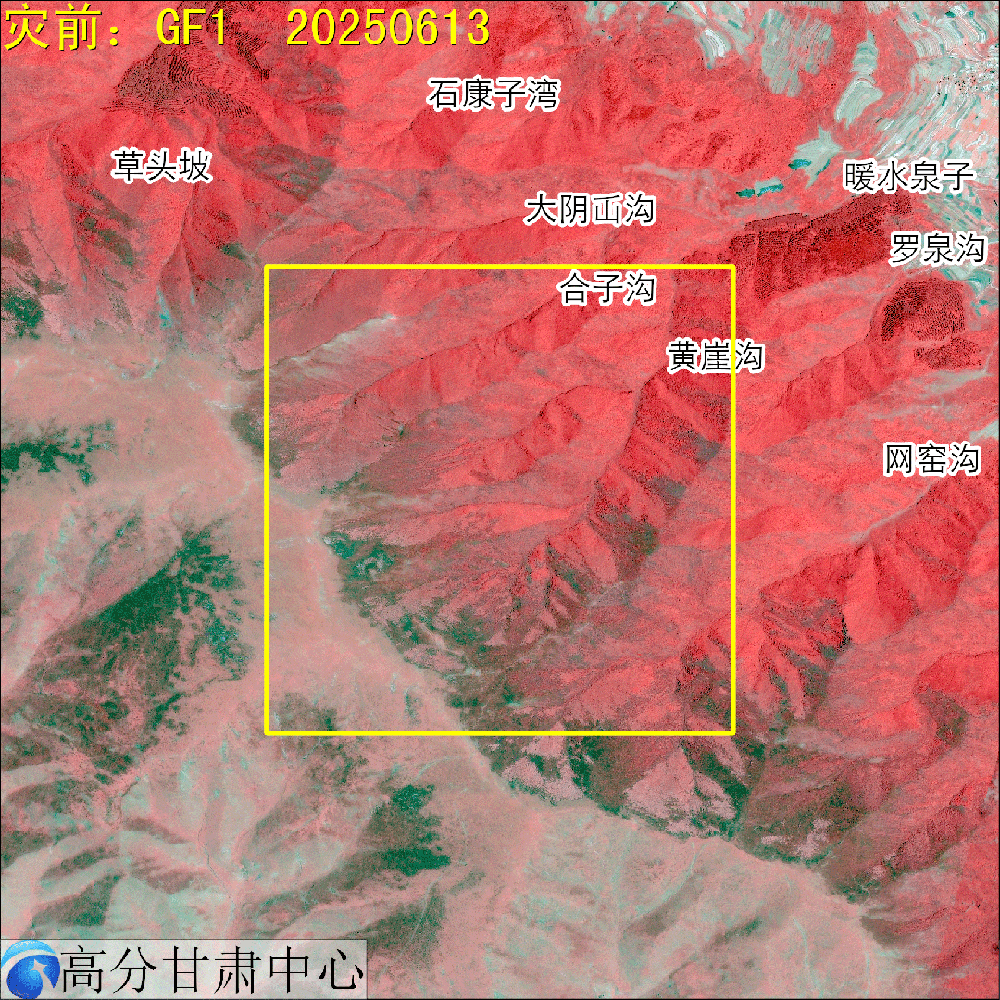
  <p><em>物理约束推理 1 · 物理约束推理 2 · 物理约束推理 3</em></p>
</div>

### 额外演示

<div align="center">
  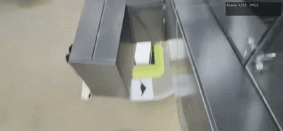
  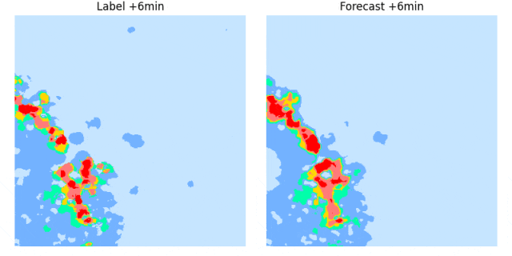
  <p><em>UAV 视觉识别演示 3 · 物理-AI 融合洞察</em></p>
</div>

---

## 🚀 快速开始

### 环境要求

| 模块 | 依赖 |
|------|------|
| **backend** | Python 3.10+, PyTorch 2.0+, CUDA 11.8+ |
| **web** | 现代浏览器 (Chrome/Edge/Firefox 90+) |
| **miniprogram** | 微信开发者工具 v1.06+, 基础库 2.32+ |
| **api** | Node.js 18+, npm |

### Backend — Python ML 框架

```bash
cd backend
pip install -r requirements.txt

# 启动 Dragon 科研助手 CLI
python __init__.py

# 训练 MambaSwin-UNet-STA 模型
python src/training/train.py --config configs/model.yaml

# 运行测试验证
python tests/test_model.py
```

### Web — 可视化大屏

```bash
# 零构建，纯静态 — 浏览器直接打开
open web/index.html        # macOS
start web/index.html       # Windows
xdg-open web/index.html    # Linux

# 或部署到 GitHub Pages / Vercel / Nginx
```

### Mini Program — 微信小程序

```bash
# 1. 微信开发者工具 → 导入项目
# 2. 选择 miniprogram/ 目录
# 3. 替换 touristappid 为你的 AppID
# 4. 编译运行
```

### API — 后端服务

```bash
cd api
cp .env.example .env
# 编辑 .env 填入你的 API Keys
npm install
npm start
# 访问 http://localhost:3001/api/weather?city=620123
```

---

## 📊 评估指标

| 指标 | 公式 | 目标值 |
|------|------|--------|
| **TS** (Threat Score) | H / (H + M + F) | > 0.50 |
| **POD** (Probability of Detection) | H / (H + M) | > 0.80 |
| **FAR** (False Alarm Rate) | F / (H + F) | < 0.30 |
| **CSI** (Critical Success Index) | H / (H + M + F) | > 0.50 |
| **ETS** (Equitable Threat Score) | (H − H_random) / (H + M + F − H_random) | > 0.30 |

*H = Hits (命中), M = Misses (漏报), F = False Alarms (空报)*

<div align="center">
  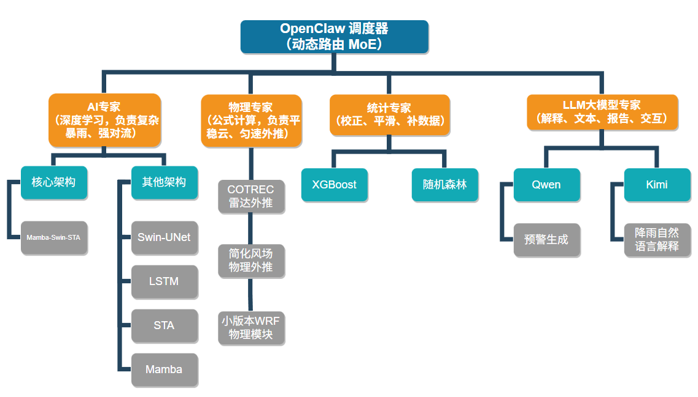
  <p><em>物理约束与AI融合 — 提升预测精度与可解释性</em></p>
</div>

---

## 🗓️ 项目路线图

| 阶段 | 时间 | 核心任务 | 状态 |
|------|------|----------|------|
| 📊 **数据治理** | 2026.04–05 | 雨量脱敏清洗、缺失插补、DEM特征、基线验证 | ✅ 完成 |
| 🧪 **模型训练** | 2026.05–08 | MambaSwin-UNet-STA搭建、动态路由、超参调优 | 🔄 进行中 |
| 🔗 **系统集成** | 2026.08–11 | SCS-CN耦合、风险推演插件、端到端测试 | ⬜ 待开始 |
| ✅ **验证评估** | 2026.12–2027.01 | 典型暴雨个例、实地调研、可用性评估 | ⬜ 待开始 |
| 📝 **结题验收** | 2027.02–04 | 论文撰写、代码开源、答辩准备 | ⬜ 待开始 |

---

## 👥 团队

| 角色 | 信息 |
|------|------|
| **团队名称** | 智驭苍穹 (Wisdom Commands the Skies) |
| **所属学校** | 兰州大学 (Lanzhou University) |
| **学院** | 萃英学院 · 大气科学学院 |
| **指导老师** | 胡淑娟 教授 |
| **项目负责人** | 彭小溪 |
| **资助项目** | 国家大学生创新训练计划 · 䇹政基金 |
| **执行周期** | 2026年4月 – 2027年4月 |

---

## 📄 许可证

MIT License © 2026 NOBEL-Pxx

详见 [LICENSE](LICENSE)

---

## 📞 联系方式

- 📧 Email: pxx05247258@gmail.com
- 📍 地址: 兰州大学城关校区，兰州，甘肃，中国
- 🌐 GitHub: [github.com/NOBEL-Pxx/railway-ai-warning](https://github.com/NOBEL-Pxx/railway-ai-warning)

---

<div align="center">

**🛤️ 空天地一体 · AI赋能铁路 · 守护万里安澜 🛤️**  
*Air, Space, and Ground United — AI Empowering Railways — Safeguarding Every Mile*

</div>
