# 🛤️ 智驭苍穹 · 守路安澜 — Railway AI Warning System

<div align="center">

**Air-Space-Ground Multi-Modal Short-Imminent Disaster Risk Digital Twin Warning System**

[](https://www.python.org/)
[](https://pytorch.org/)
[](https://developers.weixin.qq.com/)
[](LICENSE)
[](https://www.lzu.edu.cn/)

[English](#-overview) | [中文](#-项目概述)

</div>

---

## 📖 Overview

**"智驭苍穹 · 守路安澜"** (Wisdom Commands the Skies · Safeguarding the Rails) is a comprehensive AI-powered railway disaster warning system. It integrates **AI, meteorology, railway engineering, and low-altitude drone technology** through the proprietary **LoongClaw Dynamic Router Mixture-of-Experts (MoE) framework** to deliver minute-level early warnings for railway corridor hazards.

> **One-line pitch**: AI-empowered railway disaster prevention digital twin command center.

### 🎯 System Visualization

<div align="center">
  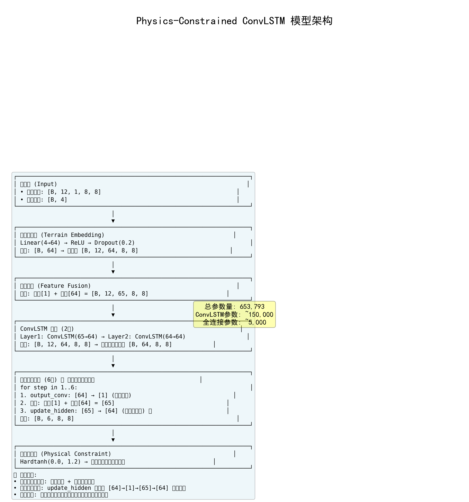
  <p><em>LoongClaw MoE Architecture — Four Expert Systems Collaborative Inference</em></p>
</div>

---

## 🔬 Key Innovations

| Innovation | Description | Visual |
|-----------|-------------|--------|
| **MambaSwin-UNet-STA** | Novel deep learning architecture fusing Mamba SSM, Swin Transformer, U-Net, and Spatiotemporal Attention — 45M parameters, 200ms inference | 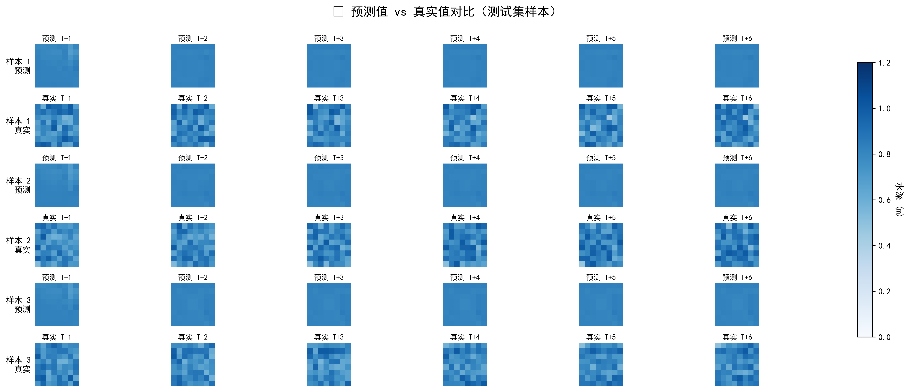 |
| **LoongClaw MoE Framework** | Dynamic routing among AI/Physics/Meteorology/Railway four expert systems with adaptive weight distribution | 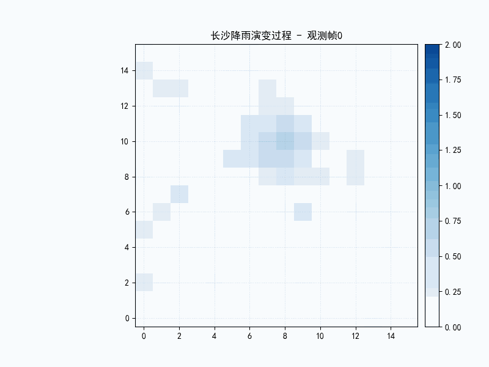 |
| **3D Digital Twin** | Real-time 3D terrain-coupled precipitation nowcasting and flood simulation | 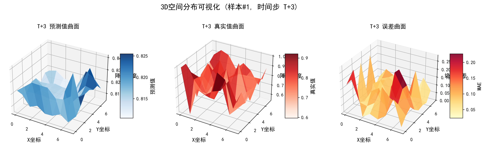 |
| **SCS-CN Hydrology** | Physics-constrained runoff modeling for disaster risk inference along railway corridors | 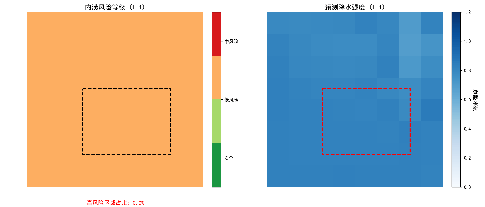 |

### 📊 Model Performance

<div align="center">
  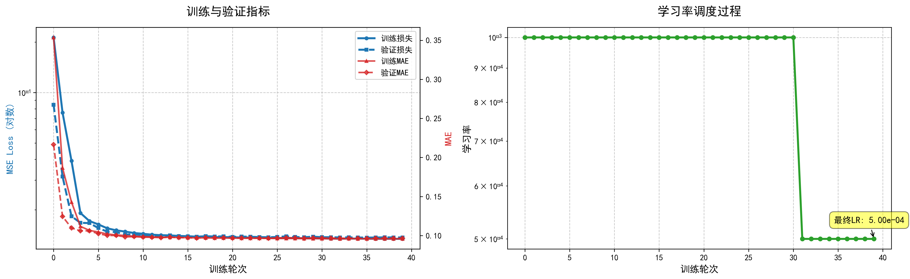
  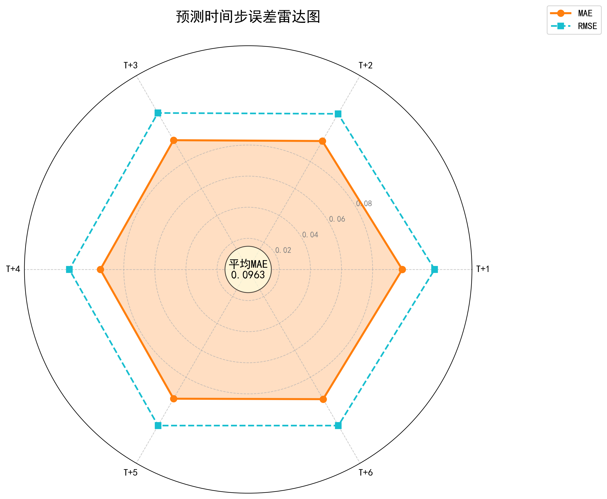
  <p><em>Training convergence (left) and temporal error radar analysis (right)</em></p>
</div>

### 🌊 Flood Risk & Terrain Analysis

<div align="center">
  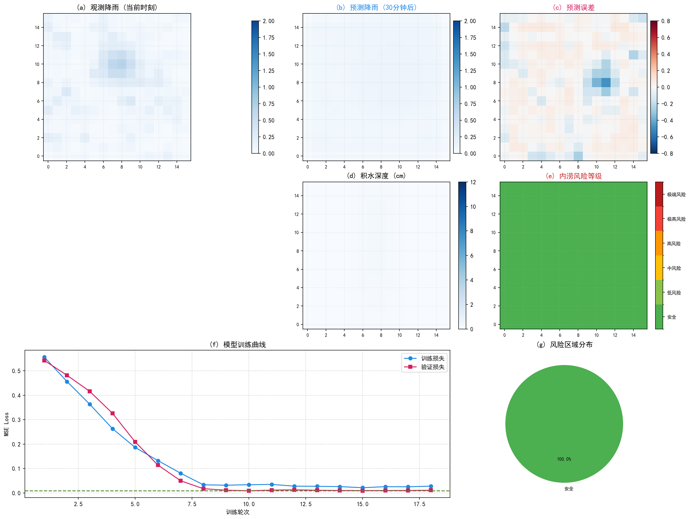
  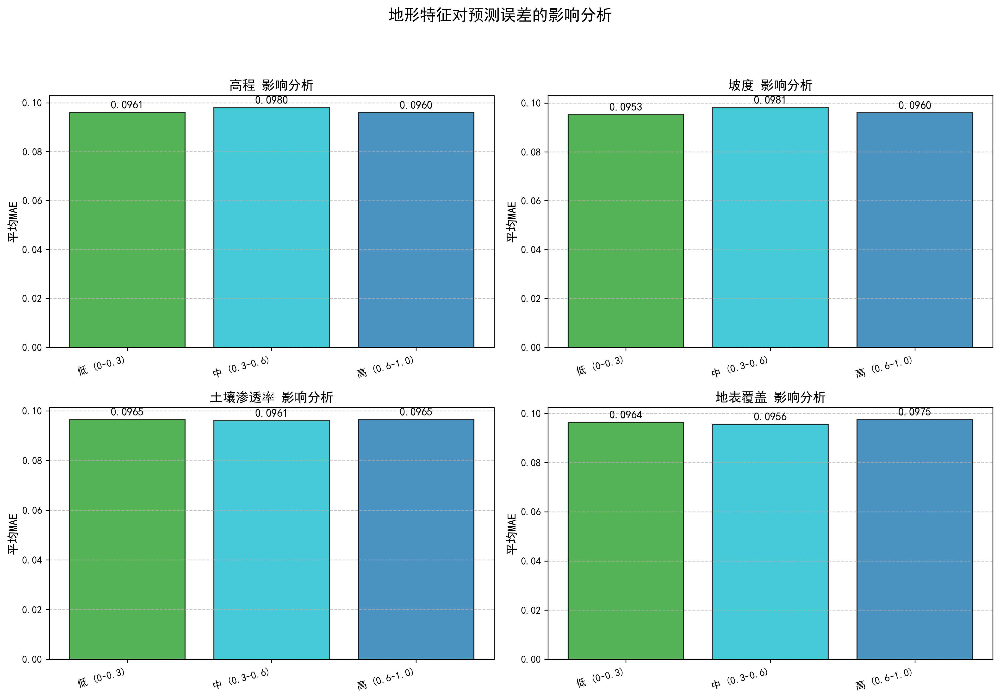
  <p><em>Changsha railway corridor flood risk (left) and terrain forcing impact on precipitation (right)</em></p>
</div>

### 🎬 Dynamic Simulations

<div align="center">
  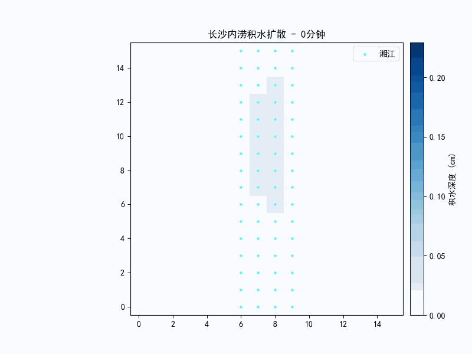
  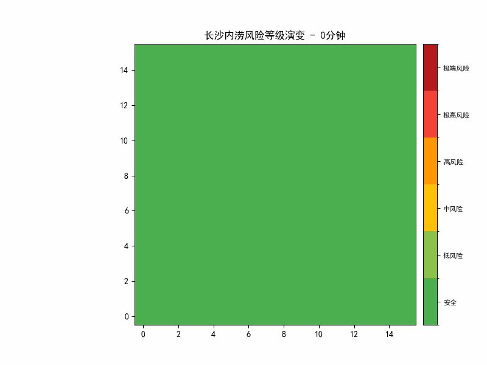
  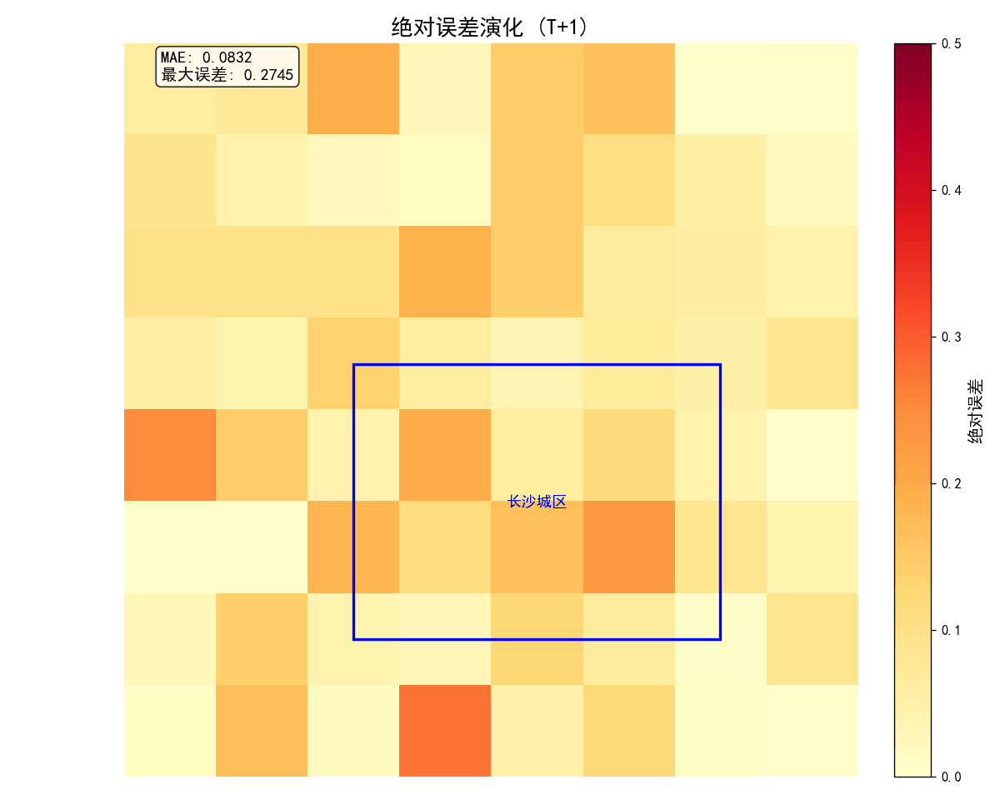
  <p><em>Water propagation simulation · Risk level evolution · Prediction error dynamics</em></p>
</div>

### 🏔️ 3D Terrain-Coupled Visualization

<div align="center">
  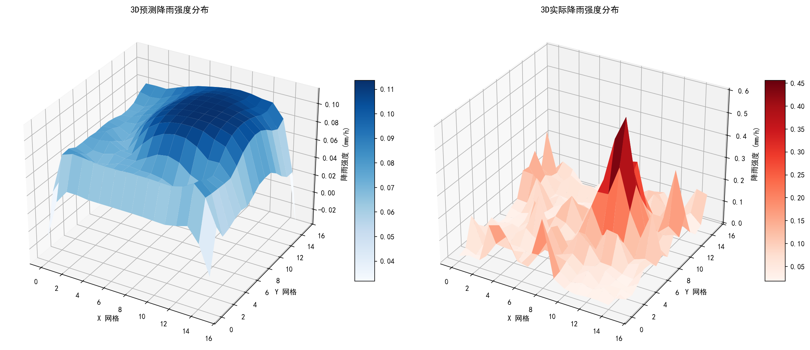
  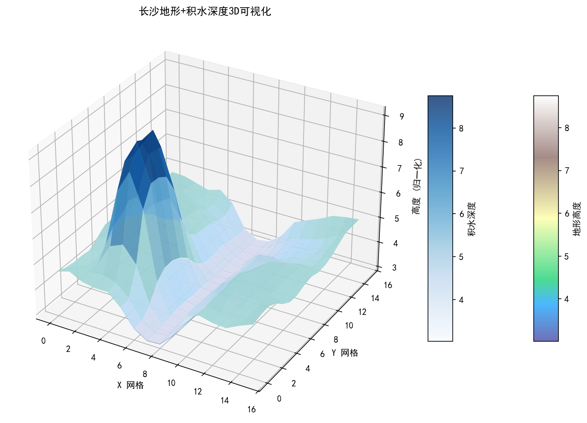
  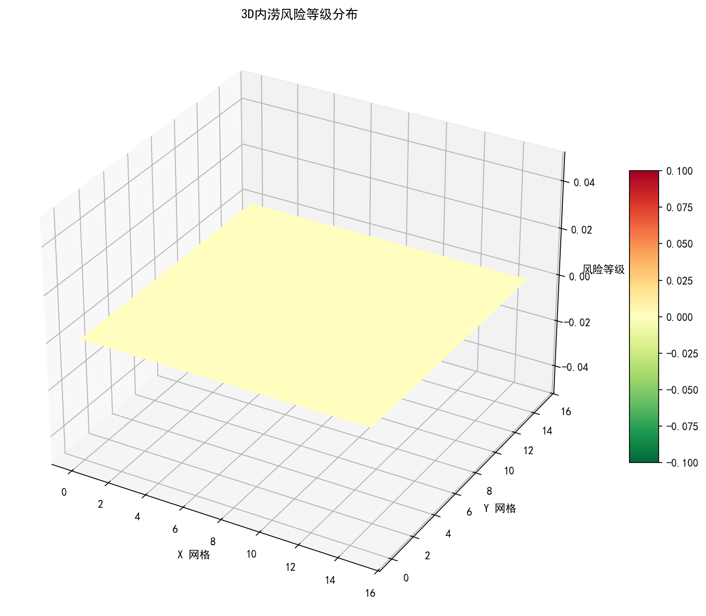
  <p><em>3D rainfall field · Terrain-coupled water accumulation · Risk distribution in 3D space</em></p>
</div>

---

## 🏗️ Repository Structure

```
railway-ai-warning/
│
├── README.md                         # Master README (this file)
├── LICENSE                           # MIT License
├── .gitignore
├── assets/                           # 🎨 Visual assets
│   ├── figures/                      # Static figures (PNG)
│   └── animations/                   # Animated demos (GIF)
│
├── backend/                          # 🐍 Python ML Framework
│   ├── README.md
│   ├── requirements.txt
│   ├── __init__.py                   # Dragon class entry point
│   ├── core/                         # Agent framework
│   │   ├── agent.py                  # Task planning engine
│   │   ├── dialog.py                 # Dialogue manager
│   │   ├── memory.py                 # Memory system
│   │   ├── skills.py                 # Skill manager (13 skills)
│   │   └── workflow.py               # Workflow engine
│   ├── src/                          # ML source code
│   │   ├── models/                   # MambaSwin-UNet-STA, Router, Physics
│   │   ├── data/                     # Preprocessing, Features, Interpolation
│   │   ├── training/train.py         # PyTorch Lightning training
│   │   └── utils/                    # Loss functions, Metrics
│   ├── scripts/                      # ERA5 & DEM download
│   ├── tests/                        # Unit & integration tests
│   ├── configs/                      # project.yaml, model.yaml
│   ├── skills/                       # Extensible skill modules
│   └── knowledge/                    # Domain knowledge base
│
├── web/                              # 🌐 Web Visualization Dashboard
│   ├── index.html                    # 3D starfield entry portal
│   ├── core.html                     # LoongClaw engine
│   ├── system.html                   # Holographic overview
│   ├── community.html                # Ecosystem & partnerships
│   ├── universe.html                 # Technology universe
│   ├── dashboard.html                # Real-time data cockpit
│   ├── sky.html                      # UAV swarm management
│   ├── scripts/                      # News auto-collector
│   └── assets/                       # PDFs, images, videos
│
├── miniprogram/                      # 📱 WeChat Mini Program
│   ├── project.config.json
│   ├── app.js / app.json / app.wxss
│   ├── pages/                        # 12 business pages
│   ├── components/                   # 8 reusable components
│   └── images/                       # Icons & illustrations
│
├── research/                         # 🔬 Auxiliary Research Code
│   ├── convlstm/                     # ConvLSTM baseline model
│   └── figures/                      # Research result figures
│
├── docs/                             # 📄 Documentation
│   ├── proposals/                    # Project proposals
│   ├── technical/                    # Technical documents
│   ├── data_dict.md                  # Data dictionary
│   ├── architecture.md               # System architecture
│   ├── plan.md                       # Project plan
│   └── roadmap.md                    # Technical roadmap
│
├── data/                             # 📊 Data (gitignored)
└── .github/                          # ⚙️ GitHub workflows
```

---

## 🚀 Quick Start

### Prerequisites
- **Python 3.10+** with PyTorch 2.0+ (for backend)
- **Modern browser** (Chrome/Edge/Firefox) for Web dashboard
- **WeChat DevTools** v1.06+ (for mini program)

### Backend (ML Framework)

```bash
cd backend
pip install -r requirements.txt

# Launch research assistant CLI
python __init__.py

# Train the MambaSwin-UNet-STA model
python src/training/train.py --config configs/model.yaml

# Run model tests
python tests/test_model.py
```

### Web Dashboard

```bash
# No build step required — pure HTML/CSS/JS
open web/index.html        # macOS
start web/index.html       # Windows
xdg-open web/index.html    # Linux

# Or deploy to any static server (GitHub Pages / Vercel / Nginx)
```

### WeChat Mini Program

```bash
# 1. Open WeChat DevTools
# 2. Import project → select miniprogram/ directory
# 3. Replace "touristappid" in project.config.json with your AppID
# 4. Compile & run
```

---

## 🧠 LoongClaw MoE Architecture

| Expert | Core Model | Specialty |
|--------|-----------|-----------|
| 🤖 **AI Expert** | MambaSwin-UNet-STA (45M params) | End-to-end precipitation forecasting, spatiotemporal feature extraction |
| 🔬 **Physics Expert** | COTREC + WRF | Numerical weather prediction, PDE physical constraints |
| 🌤️ **Meteorology Expert** | FY-4A + Doppler Radar | Multi-source meteorological data fusion, satellite retrieval |
| 🚄 **Railway Expert** | Disaster KG + Fragility Curves | Railway risk assessment, infrastructure vulnerability analysis |

### Dynamic Router Mechanism

The LoongClaw router adaptively allocates expert weights based on real-time weather context (convection intensity, stability index, system speed, precipitation intensity, terrain complexity). Each expert's prediction is weighted and fused for the final nowcast.

---

## 📊 Evaluation Metrics

| Metric | Formula | Target |
|--------|---------|--------|
| **TS** (Threat Score) | H / (H + M + F) | > 0.50 |
| **POD** (Probability of Detection) | H / (H + M) | > 0.80 |
| **FAR** (False Alarm Rate) | F / (H + F) | < 0.30 |
| **CSI** (Critical Success Index) | H / (H + M + F) | > 0.50 |
| **ETS** (Equitable Threat Score) | (H - H_random) / (H + M + F - H_random) | > 0.30 |

*H = Hits, M = Misses, F = False Alarms*

<div align="center">
  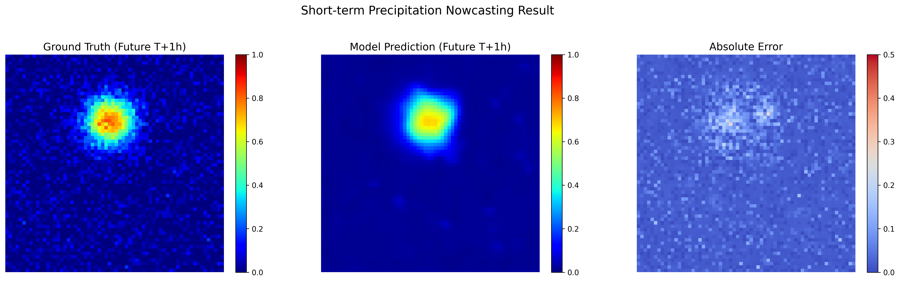
  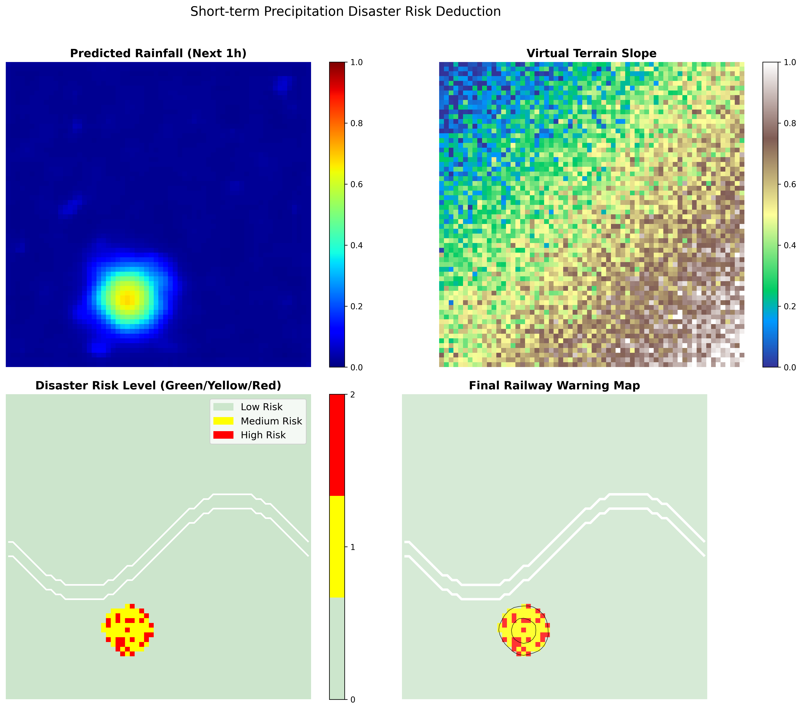
  <p><em>Real-data prediction validation (left) and railway corridor risk deduction (right)</em></p>
</div>

---

## 🗓️ Project Roadmap

| Phase | Period | Key Tasks | Status |
|-------|--------|-----------|--------|
| 📊 Data Governance | 2026.04–05 | Data cleaning, interpolation, terrain features, baseline validation | ✅ Complete |
| 🧪 Model Training | 2026.05–08 | MambaSwin-UNet-STA, dynamic router, hyperparameter tuning, ablation | 🔄 In Progress |
| 🔗 System Integration | 2026.08–11 | SCS-CN coupling, risk inference plugin, end-to-end testing | ⬜ Pending |
| ✅ Validation | 2026.12–2027.01 | Storm case studies, field investigation, usability assessment | ⬜ Pending |
| 📝 Finalization | 2027.02–04 | Paper writing, code open-sourcing, defense preparation | ⬜ Pending |

---

## 👥 Team

| Role | Detail |
|------|--------|
| **Team Name** | 智驭苍穹 (Wisdom Commands the Skies) |
| **University** | Lanzhou University (兰州大学) |
| **Advisor** | Prof. Hu Shujuan (胡淑娟 教授) |
| **Project Lead** | Peng Xiaoxi (彭小溪) |
| **Program** | National Undergraduate Innovation Training Program · 䇹政基金 |


---

## 📄 License

This project is licensed under the [MIT License](LICENSE).

## 📞 Contact

- 📧 Email: pxx05247258@gmail.com
- 📍 Address: Lanzhou University, Chengguan District, Lanzhou, China
- 🌐 GitHub: [NOBEL-Pxx/railway-ai-warning](https://github.com/NOBEL-Pxx/railway-ai-warning)

---

<div align="center">

**🛤️ 空天地一体 · AI赋能铁路 · 守护万里安澜 🛤️**

*Air, Space, and Ground United — AI Empowering Railways — Safeguarding Every Mile*

</div>
